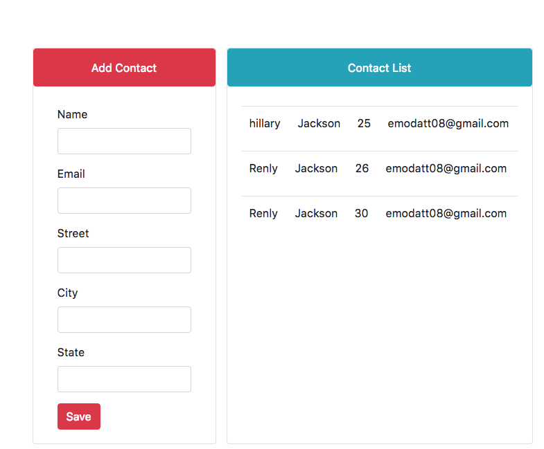

# Angular contacts manager
This repository holds the TypeScript source code of the [angular.io quickstart](https://angular.io/docs/ts/latest/quickstart.html). Powered by a flask/MySql backend, the app can be used to store contacts easily. 

<h2 id="screenshots">Screenshot</h2>



Install the npm packages described in the `package.json` and verify that it works:

```shell
npm install
npm start
```

>Doesn't work in _Bash for Windows_ which does not support servers as of January, 2017.

The `npm start` command first compiles the application, 
then simultaneously re-compiles and runs the `lite-server`.
Both the compiler and the server watch for file changes.

Shut it down manually with `Ctrl-C`.

You're ready to write your application.

### npm scripts

We've captured many of the most useful commands in npm scripts defined in the `package.json`:

* `npm start` - runs the compiler and a server at the same time, both in "watch mode".
* `npm run build` - runs the TypeScript compiler once.
* `npm run build:w` - runs the TypeScript compiler in watch mode; the process keeps running, awaiting changes to TypeScript files and re-compiling when it sees them.
* `npm run serve` - runs the [lite-server](https://www.npmjs.com/package/lite-server), a light-weight, static file server. 
[travis-badge]: https://travis-ci.org/angular/quickstart.svg?branch=master
[travis-badge-url]: https://travis-ci.org/angular/quickstart
